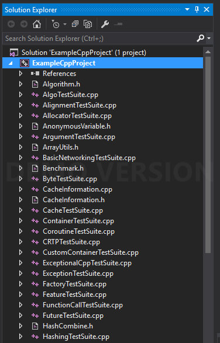
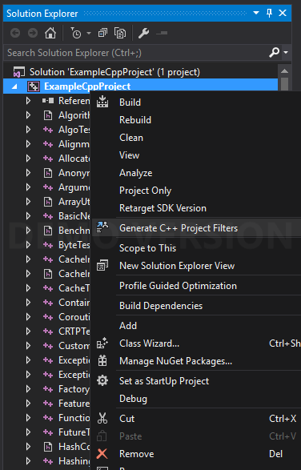
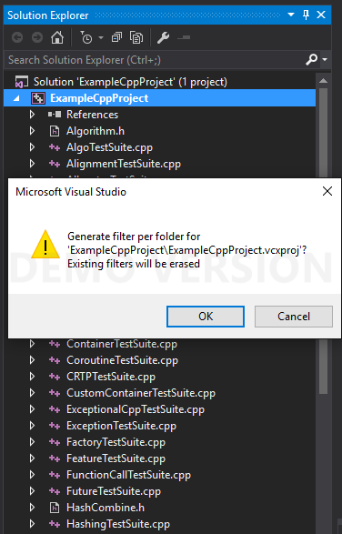
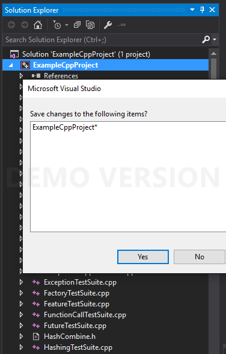

# Visual Studio C++ Plugin

[](https://ci.appveyor.com/project/Dllieu/visualstudiocppextensions)

## About
Custom plugins for Visual Studio 2015+:
- **Generate C++ Project's Filters**
 - Simple Extension which provide the ability to generate C++ project filters to replicate the folder hierarchy of the underlying sources
 - It also automatically add all the includes folder to ```AdditionalIncludeDirectories``` project parameter if needed
 - It was originally made to browse easily C++ code hosted on a Linux machine while benefiting of the Visual Studio's features (e.g. GUI, Go to Definition / Declaration, Compile / Debug through SSH, ...)

<p align="center">
  
  
</p>

## Installation
- Download the ```*.vsix``` package from the **[latest release](https://github.com/Dllieu/VisualStudioCppExtensions/releases/latest)** or from **[Visual Studio gallery](https://visualstudiogallery.msdn.microsoft.com/5a3251d7-3228-4813-a67e-6b9cc83d0507)**
- Double click on the downloaded package and follow the instructions

## Example Usage
Open an existing C++ solution

<p align="center">
  
</p>

Right click on the project for which you want to generate the filters per folder, a menu ```Generate C++ Project Filters``` will appear (*only appearing when right-clicking on a C++ project*)

<p align="center">
  
</p>

Click on ```Generate C++ Project Filters```, a confirmation will be required to generate the filters

<p align="center">
  
</p>

Once the filters are generated, the extension will automatically reload the current project if needed. Accept the changes made by the extension by clicking yes

<p align="center">
  
</p>

As a result, your C++ project will have filters that replicate your C++ sources folder hierarchy

<p align="center">
  
</p>

## Dependencies for developers
If you are interested in enhancing this extension, you must install Visual Studio 2015 SDK

### Debug
You have to change the debug settings for the VSIXProject to be able to debug it (```Properties -> Debug```)
- Start external program : ```C:\Program Files (x86)\Microsoft Visual Studio 14.0\Common7\IDE\devenv.exe```
- Command line arguments: ```/rootsuffix EXP```
